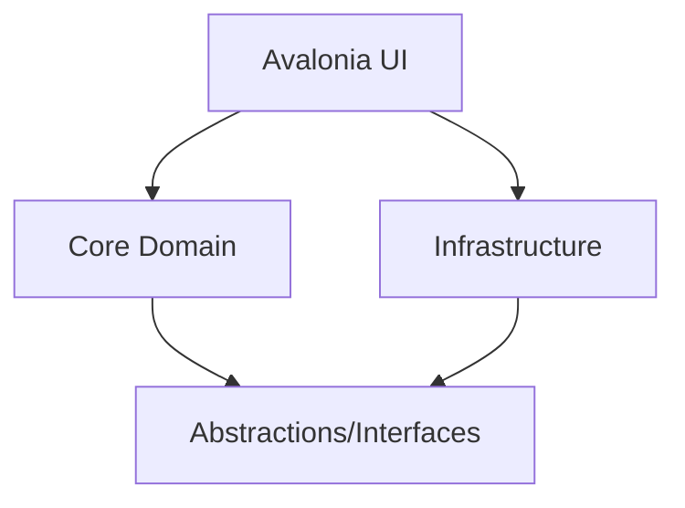

# Architecture Document
**DOCX Template CLI System v2.0**  
*BMad-Compliant Architecture*  
*Created: 2025-08-17*

---

## System Architecture Overview

This is a **Clean Architecture implementation** with complete separation of concerns between business logic, infrastructure, and presentation layers.

### Architectural Style
- **Clean Architecture** (Uncle Bob's Onion Architecture)
- **Domain-Driven Design** (DDD) principles
- **Dependency Inversion** throughout
- **Direct service integration** (UI → Core/Infrastructure)

### System Boundaries


**Key Change**: The UI now directly references Infrastructure and Core services, eliminating the CLI layer dependency for improved performance and simpler architecture.

---

## Component Architecture

### Layer Responsibilities

#### 1. Domain Core (DocxTemplate.Core)
**Purpose**: Business logic and rules, zero external dependencies

```csharp
DocxTemplate.Core/
├── Models/
│   ├── TemplateSet.cs           // Aggregate root - collection of templates
│   ├── Template.cs              // Domain entity within a set
│   ├── Placeholder.cs           // Value object
│   ├── ReplacementMap.cs        // Value object for replacements
│   ├── ValidationResult.cs      // Domain validation
│   └── TemplateSetValidationResult.cs // Template set specific validation
├── Services/
│   ├── ITemplateSetService.cs       // Manage template sets (with validation fixes)
│   ├── ITemplateDiscoveryService.cs // Discover templates within set
│   ├── IPlaceholderScanService.cs   // Scan placeholders in set
│   ├── ITemplateCopyService.cs      // Copy entire template set
│   └── IPlaceholderReplaceService.cs // Replace in template set
├── Validators/
│   ├── TemplateSetValidator.cs  // Validate set structure
│   ├── PlaceholderValidator.cs
│   └── PathValidator.cs
└── Exceptions/
    ├── DomainException.cs
    ├── TemplateSetException.cs
    └── ValidationException.cs
```

**Key Principles**:
- No external dependencies
- Immutable models with validation
- Rich domain models (not anemic)
- Business rules enforced at domain level

#### 2. Infrastructure Layer (DocxTemplate.Infrastructure)
**Purpose**: External integrations and I/O operations

```csharp
DocxTemplate.Infrastructure/
├── FileSystem/
│   ├── FileSystemService.cs
│   ├── FileDiscoveryService.cs
│   └── FileCopyService.cs
├── DocxProcessing/
│   ├── OpenXmlDocumentProcessor.cs
│   ├── PlaceholderScanner.cs
│   └── PlaceholderReplacer.cs
├── Serialization/
│   ├── JsonSerializer.cs
│   └── XmlSerializer.cs
└── Logging/
    ├── FileLogger.cs
    └── ConsoleLogger.cs
```

**Key Principles**:
- Implements core interfaces
- Handles all I/O operations
- External library integrations
- Error recovery and retries

#### 3. Presentation Layer (DocxTemplate.UI)
**Purpose**: User interaction through Avalonia-based GUI

```csharp
DocxTemplate.UI/
├── ViewModels/
│   ├── WizardViewModel.cs
│   ├── TemplateSetSelectionViewModel.cs
│   ├── PlaceholderDiscoveryViewModel.cs
│   ├── PlaceholderInputViewModel.cs
│   ├── OutputFolderSelectionViewModel.cs
│   └── ProcessingResultsViewModel.cs
├── Views/
│   ├── MainWindow.axaml
│   └── Steps/ (wizard steps)
├── Services/
│   └── TemplateSetDiscoveryService.cs
└── Program.cs
```

**Key Principles**:
- MVVM architecture with ReactiveUI
- Direct service injection from Core/Infrastructure
- Czech localization throughout
- Wizard-based workflow

---

## Data Flow Architecture

### Template Set Workflow
```
1. List Sets → 2. Select Set → 3. Scan Set → 4. Copy Set → 5. Replace in Set
```

### UI Execution Flow
```
User Interaction → ViewModel → Core Service → Infrastructure → Result → ViewModel Update → UI Update
```

### Direct Service Integration
```
Before: UI → CLI Process → JSON → Core Services
After:  UI → Core/Infrastructure Services (Direct Method Calls)
```

### Example: Complete Template Set Processing (UI Workflow)
```
1. Template Selection: User selects "01 VZOR Užší řízení" from discovered template sets

2. Placeholder Discovery: UI scans templates and displays 25 unique placeholders

3. Value Input: User provides values for placeholders including SOUBOR_PREFIX

4. Output Selection: User chooses output directory

5. Processing: UI copies templates and replaces placeholders, showing progress
   Output: Processed 15 documents with Czech file naming (e.g., "2024_12_TestováníČeština_dokument.docx")
```

### Template Set Structure Example
```
/templates                     # Root templates folder
├── Contract_Templates/        # Template Set 1
│   ├── Sales/
│   │   ├── contract.docx
│   │   └── addendum.docx
│   ├── Services/
│   │   ├── sla.docx
│   │   └── support.docx
│   └── terms.docx
├── Invoice_Templates/         # Template Set 2
│   ├── standard.docx
│   ├── proforma.docx
│   └── credit_note.docx
└── Report_Templates/          # Template Set 3
    ├── monthly.docx
    ├── quarterly.docx
    └── annual.docx
```

---

## Design Patterns & Principles

### Dependency Injection
```csharp
// Program.cs
services.AddScoped<ITemplateDiscoveryService, TemplateDiscoveryService>();
services.AddScoped<IFileSystemService, FileSystemService>();
services.AddScoped<IDocumentProcessor, OpenXmlDocumentProcessor>();
```

### Repository Pattern
```csharp
public interface ITemplateRepository
{
    Task<IEnumerable<Template>> GetAllAsync(string path);
    Task<Template> GetByPathAsync(string path);
    Task SaveAsync(Template template, string path);
}
```

### Strategy Pattern (Output Formatting)
```csharp
public interface IOutputFormatter
{
    string Format(object data);
    string ContentType { get; }
}

// Usage
IOutputFormatter formatter = options.Format switch
{
    "json" => new JsonFormatter(),
    "xml" => new XmlFormatter(),
    _ => new TextFormatter()
};
```

### Chain of Responsibility (Pipeline)
```csharp
public class PipelineProcessor
{
    public async Task<T> ProcessAsync<T>(
        Stream input, 
        ICommand<T> command,
        CancellationToken cancellationToken)
    {
        var inputData = await DeserializeInput(input);
        var result = await command.ExecuteAsync(inputData, cancellationToken);
        return result;
    }
}
```

---

## Cross-Cutting Concerns

### Error Handling Architecture
```csharp
// Domain exceptions
DomainException
├── ValidationException
├── PlaceholderNotFoundException  
└── TemplateCorruptedException

// Infrastructure exceptions
InfrastructureException
├── FileAccessException
├── NetworkException
└── SerializationException

// CLI exceptions
CommandException
├── ArgumentException
├── PipelineException
└── FormatterException
```

### Logging Strategy
- Structured logging with correlation IDs
- Log levels: Trace, Debug, Info, Warning, Error, Fatal
- Contextual information in all logs
- Performance metrics logging

### Security Considerations
```csharp
// Path validation to prevent directory traversal
public class PathValidator
{
    public bool IsValidPath(string path)
    {
        var fullPath = Path.GetFullPath(path);
        var basePath = Path.GetFullPath(AppContext.BaseDirectory);
        return fullPath.StartsWith(basePath);
    }
}
```

---

## Performance Architecture

### Async/Await Throughout
```csharp
public async Task<IEnumerable<Template>> DiscoverAsync(
    string path, 
    CancellationToken cancellationToken)
{
    // All I/O operations are async
    await foreach (var file in EnumerateFilesAsync(path))
    {
        yield return await ProcessFileAsync(file);
    }
}
```

### Parallel Processing
```csharp
public async Task<ReplaceResult> ReplaceInParallelAsync(
    IEnumerable<string> files,
    Dictionary<string, string> replacements)
{
    var tasks = files.Select(file => 
        ReplaceInFileAsync(file, replacements));
    
    var results = await Task.WhenAll(tasks);
    return AggregateResults(results);
}
```

### Memory Management
- Stream processing for large files
- Dispose pattern for resources
- Memory pooling for buffers
- Lazy loading where appropriate

---

## Testing Architecture

### Unit Testing Strategy
```csharp
DocxTemplate.Core.Tests/
├── Models/          # Domain model tests
├── Services/        # Service logic tests
└── Validators/      # Validation tests

// Example test
[Fact]
public async Task DiscoverService_FindsAllDocxFiles()
{
    // arrange
    var mockFileSystem = new Mock<IFileSystemService>();
    var service = new TemplateDiscoveryService(mockFileSystem.Object);
    
    // act
    var results = await service.DiscoverAsync("/test");
    
    // assert
    Assert.Equal(5, results.Count());
}
```

### Integration Testing
```csharp
DocxTemplate.Integration.Tests/
├── CommandTests/    # CLI command integration
├── PipelineTests/   # Pipeline flow tests
└── E2ETests/        # Full workflow tests
```

### Performance Testing
```csharp
[Benchmark]
public async Task ProcessHundredTemplates()
{
    var templates = GenerateTemplates(100);
    await processor.ProcessAllAsync(templates);
}
```

---

## Deployment Architecture

### Build Outputs
```
/dist
├── win-x64/
│   └── docx-template.exe (self-contained, primary platform)
├── osx-x64/                      [Future iteration]
│   └── docx-template (self-contained)
├── linux-x64/                    [Not required for current scope]
│   └── docx-template (self-contained)
└── portable/
    └── DocxTemplate.CLI.dll (framework-dependent)
```

### Configuration
```json
// appsettings.json
{
  "Logging": {
    "Level": "Information",
    "File": "logs/docx-template.log"
  },
  "Processing": {
    "MaxParallelFiles": 10,
    "BackupEnabled": true,
    "DefaultPattern": "{{.*?}}"
  }
}
```

---

## Future Architecture Extensions

### Direct Service Integration
```csharp
// UI directly uses Infrastructure services
public class PlaceholderDiscoveryViewModel
{
    private readonly IPlaceholderScanService _scanService;
    
    public async Task DiscoverPlaceholdersAsync(string templatePath)
    {
        var result = await _scanService.ScanAsync(templatePath);
        // Direct domain model usage, no JSON parsing needed
        UpdateUI(result.Placeholders);
    }
}
```

### API Layer (Future)
```csharp
// REST API over CLI commands
[ApiController]
[Route("api/templates")]
public class TemplateController : ControllerBase
{
    [HttpGet("discover")]
    public async Task<IActionResult> Discover([FromQuery] string path)
    {
        var result = await discoveryService.DiscoverAsync(path);
        return Ok(result);
    }
}
```

### Plugin Architecture (Future)
```csharp
public interface ITemplatePlugin
{
    string Name { get; }
    Task<object> ProcessAsync(Template template);
}
```

---

## Architecture Decision Records (ADRs)

### ADR-001: Clean Architecture
**Decision**: Use Clean Architecture with dependency inversion  
**Rationale**: Ensures business logic remains independent of infrastructure  
**Consequences**: More initial setup but better testability and maintainability

### ADR-002: Async Throughout
**Decision**: All I/O operations use async/await  
**Rationale**: Better performance and scalability  
**Consequences**: Slightly more complex but enables parallel processing

### ADR-003: Immutable Domain Models
**Decision**: Domain models are immutable with init-only properties  
**Rationale**: Thread-safe and prevents accidental mutations  
**Consequences**: Requires builders or with-expressions for modifications

### ADR-004: System.CommandLine
**Decision**: Use System.CommandLine for CLI parsing  
**Rationale**: Modern, strongly-typed, built-in help generation  
**Consequences**: Preview package but Microsoft-supported

---

*This architecture document defines the technical structure and design decisions for the DOCX Template CLI v2.0 system, ensuring scalability, maintainability, and testability.*